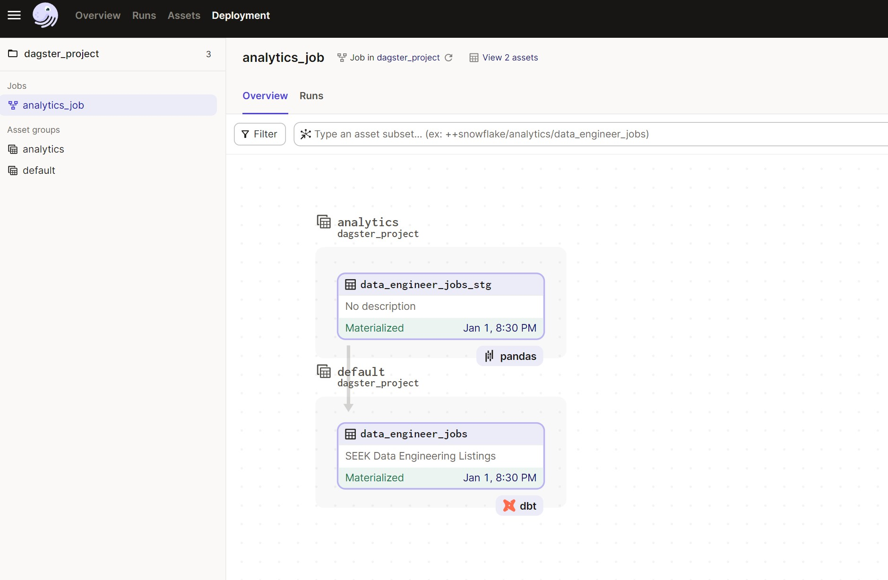
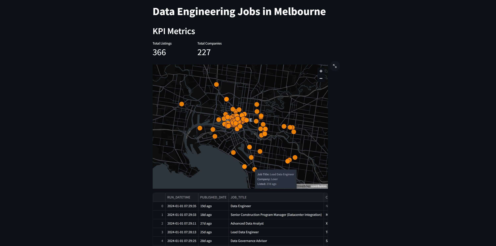

# Job Listings Pipeline

The purpose of this project was to explore data orchestration with Dagster and reporting with Streamlit. 

Created a basic data pipeline that scrapes data engineering job listings from seek.com.au. The data is enriched with coordinates based on the company name and listing location.

## Stack
- Dagster (Orchestration/Scheduling)
- dbt (Data Transformation)
- Snowflake (Storage/Modelling)
- Streamlit (Reporting)
- Docker (Infrustrcuture/Deployment)

Utilizes Google's Geocoding API to retrieve coordinates.

## Pipeline Overview

1. Scrape Data Engineering Listings in Melbourne, Australia
2. Geocode listings based on company name and listing location
3. Utilise SnowflakePandasIOManager to store Dataframe in Snowflake staging table
4. DBT incremental model transforms staging data and store in new Snowflake table. Only include listings which contain "Data"
5. Streamlit report contains basic visuals
    - Basic count KPIs
    - Map of job listings
    - Table of data

